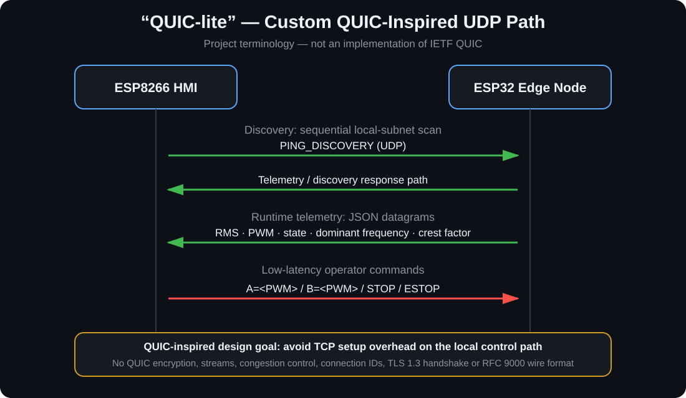
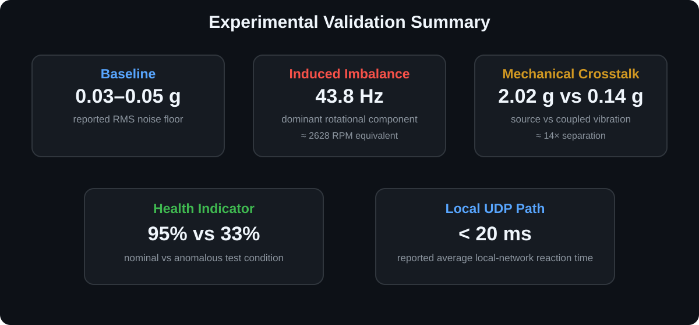

# DC Motor Predictive Maintenance & Condition Monitoring


An **ESP32/ESP8266 edge-computing prototype** for real-time vibration-based condition monitoring of two DC motors. The system acquires vibration data from dual MPU6050 sensors, extracts diagnostic features locally using FFT-based DSP, drives the motors through a TB6612FNG, and distributes telemetry to a local HMI, web dashboard and MQTT endpoint.

> **Scope:** the implemented system performs condition monitoring, anomaly detection and engineering health-indicator extraction. It does **not** currently estimate Remaining Useful Life (RUL) or predict an absolute failure time.

<p align="center"></p>

## Highlights

- Two-channel vibration acquisition using **2 × MPU6050** sensors
- **400 Hz** sampling and **256-sample** FFT frames
- RMS, peak, crest factor, dominant frequency and spectral-band energy extraction
- Custom **100–180 Hz bearing-oriented energy indicator**
- RMS-derived 0–100% engineering health indicator
- FreeRTOS dual-core task partitioning on **ESP32-WROOM-32**
- Independent ESP32 hardware I2C buses: **400 kHz + 100 kHz**
- Local **ESP8266 HMI** with SSD1306 OLED, keypad, PCF8574 and buzzer
- **20 kHz / 8-bit PWM** control through a TB6612FNG dual H-bridge
- HTTP + WebSocket browser dashboard and MQTT secondary telemetry
- Custom **QUIC-inspired UDP control/telemetry path** for the local HMI
- Experimental imbalance and mechanical-crosstalk validation

## QUIC-inspired local UDP path


The project documentation calls the fast local protocol **“QUIC-lite.”** This is a project-specific protocol built directly on UDP and **inspired by QUIC’s low-latency design goals**. It is **not an implementation of IETF QUIC / RFC 9000**.

<p align="center"></p>

Implemented behavior includes:

- local subnet discovery using `PING_DISCOVERY` probes;
- learning the peer IP from received UDP datagrams;
- JSON telemetry datagrams;
- direct motor commands (`A=<PWM>`, `B=<PWM>`, `STOP`, `ESTOP`);
- no TCP connection setup on the HMI control path.

It does **not** implement QUIC packet framing, TLS 1.3 integration, encrypted transport, multiplexed streams, QUIC connection IDs, congestion control or the RFC 9000 wire format. See [`docs/COMMUNICATIONS.md`](docs/COMMUNICATIONS.md).

## Edge DSP pipeline


```text
MPU6050 acceleration
        │
        ▼
per-sensor offset compensation
        │
        ▼
3-axis magnitude + static-gravity removal
        │
        ▼
frame mean removal
        │
        ├──────► RMS / Peak / Crest Factor
        │
        ▼
Hamming window
        │
        ▼
FFT + low-frequency suppression
        │
        ├──────► dominant frequency
        ├──────► 100–180 Hz relative spectral energy
        └──────► RMS-derived health indicator
```

The firmware samples both channels, calculates the features locally and shares the resulting metrics/spectra with the networking task through mutex-protected buffers.

## Real-time architecture

| ESP32 core | Task | Responsibilities |
|---|---|---|
| Core 1 | `SensTask` | Dual MPU6050 acquisition, frame generation, DSP/FFT, metric extraction |
| Core 0 | `NetTask` | Wi-Fi, UDP, MQTT, WebSocket and HTTP services |

The sensor task runs at higher priority than the network task. The code uses FreeRTOS mutexes around shared metrics and FFT buffers.

## Hardware

- ESP32-WROOM-32 edge node
- ESP8266 / IdeaSpark HMI board
- 2 × MPU6050 accelerometer/gyroscope modules
- TB6612FNG dual motor driver
- 2 × DC motors
- SSD1306 OLED
- PCF8574 I/O expander
- 4×4 matrix keypad
- buzzer
- 100 nF logic-side decoupling and 470 µF motor-supply bulk capacitance in the documented prototype

### Dual-Bus I2C

| Path | Pins | Speed |
|---|---|---:|
| Sensor bus 0 | SDA 21 / SCL 22 | 400 kHz |
| Sensor bus 1 | SDA 18 / SCL 19 | 100 kHz |

Using both ESP32 hardware I2C controllers avoids adding an external multiplexer for the two vibration sensors. During prototyping, one MPU6050-compatible unit reported a non-standard `WHO_AM_I` value (`0x72`); the project documentation records adapting the library validation path to support that device.

## Condition indicators

| Metric | Interpretation |
|---|---|
| RMS | Overall vibration severity |
| Peak | Maximum frame excursion |
| Crest factor | Relative impulsiveness of the vibration signal |
| Dominant frequency | Strongest spectral component after preprocessing |
| Bearing indicator | Fraction of spectral energy inside the configured 100–180 Hz band |
| Health indicator | Linear RMS-based 0–100% engineering condition score |

The health score is a **heuristic condition indicator**, not a probability of failure.


## Experimental validation

<p align="center"></p>

The submitted technical report documents a mechanically coupled two-motor test setup with baseline and induced-anomaly testing. Reported observations include:

- stationary baseline RMS around **0.03–0.05 g**;
- induced imbalance producing a dominant component at **43.8 Hz** (~2628 RPM equivalent);
- RMS around **2.02 g** at the primary anomaly source versus **0.14 g** at the mechanically coupled neighboring motor;
- approximately **14×** energetic separation in that experiment;
- reported health indicators of approximately **33%** for the anomalous motor and **95%** for the nominal reference;
- reported average reaction time below **20 ms** on the local UDP path in the tested LAN environment;
- dashboard loading measurements of **645 ms cold** versus **152 ms cached**.

These values are prototype-specific experimental results, not universal performance guarantees. Full discussion: [`docs/VALIDATION.md`](docs/VALIDATION.md).

### Baseline / Noise Floor


## Communications

| Channel | Role |
|---|---|
| Custom UDP (“QUIC-lite”) | HMI discovery, low-latency local telemetry and commands |
| MQTT | Secondary telemetry toward a central station / CLI |
| WebSocket | Live browser telemetry and FFT updates |
| HTTP | Dashboard assets and settings endpoints |
| JSON | Telemetry and command serialization where applicable |

## Web dashboard

The ESP32 serves the project SPA from SPIFFS and pushes live values over WebSocket. The UI provides condition metrics, FFT plots, health visualization and motor controls.

**Important implementation note:** the current `index.html` references Chart.js through `cdn.jsdelivr.net`, so the dashboard firmware is locally hosted but the charting dependency is **not yet fully offline/self-contained**. Client-side HTTP caching is configured to reduce repeated loading. Bundling Chart.js into SPIFFS is a recommended next cleanup step.

## Repository structure

```text
.
├── README.md
├── .gitignore
├── docs/
│   ├── ARCHITECTURE.md
│   ├── COMMUNICATIONS.md
│   ├── SETUP.md
│   ├── VALIDATION.md
│   └── assets/
│       ├── system-architecture.svg
│       ├── quic-inspired-udp.svg
│       └── validation-summary.svg
├── Edge_Computing32/
│   ├── data/                 # HTML/CSS/JavaScript dashboard
│   ├── src/                  # acquisition, DSP, motor and network firmware
│   ├── platformio.ini
│   └── partitions_no_ota.csv
└── HMI-8266/
    ├── src/                  # display, input, state and UDP HMI firmware
    └── platformio.ini
```

## Build

```bash
git clone https://github.com/onibrute/ASI-project.git
cd ASI-project

cp Edge_Computing32/src/secrets.example.h Edge_Computing32/src/secrets.h
cp HMI-8266/src/secrets.example.h HMI-8266/src/secrets.h

cd Edge_Computing32 && pio run
cd ../HMI-8266 && pio run
```

See [`docs/SETUP.md`](docs/SETUP.md) before flashing.

## Tech stack

`C++17` · `PlatformIO` · `Arduino` · `FreeRTOS` · `ESP32` · `ESP8266` · `I2C` · `MPU6050` · `arduinoFFT` · `ArduinoJson` · `ESPAsyncWebServer` · `WebSocket` · `MQTT` · `UDP` · `SPIFFS` · `U8g2` · `DSP` · `IIoT`

## Project status

Implemented:

- [x] dual vibration acquisition
- [x] real-time FFT feature extraction
- [x] dual-core edge processing
- [x] web dashboard telemetry and controls
- [x] ESP8266 local HMI
- [x] custom UDP discovery/control path
- [x] MQTT secondary telemetry
- [x] motor PWM control
- [x] experimental imbalance/crosstalk evaluation

Next steps:

- [ ] bundle all web dependencies locally for true offline operation
- [ ] collect larger labelled datasets across speed/load/fault classes
- [ ] add long-term trend storage
- [ ] TinyML anomaly detection
- [ ] NTP timestamp synchronization
- [ ] TLS/security hardening
- [ ] calibrated comparison against reference instrumentation
- [ ] RUL/prognostics research only after sufficient degradation data exist

## Documentation

- [`docs/ARCHITECTURE.md`](docs/ARCHITECTURE.md) — hardware/software architecture
- [`docs/COMMUNICATIONS.md`](docs/COMMUNICATIONS.md) — UDP “QUIC-lite”, MQTT, WebSocket and HTTP behavior
- [`docs/VALIDATION.md`](docs/VALIDATION.md) — experimental methodology, measured values and limitations
- [`docs/SETUP.md`](docs/SETUP.md) — local configuration and build workflow

## Author

**Robert Constantin Preda**  
Master's programme: Information Technologies in Systems Engineering  
Embedded Systems Architecture project
