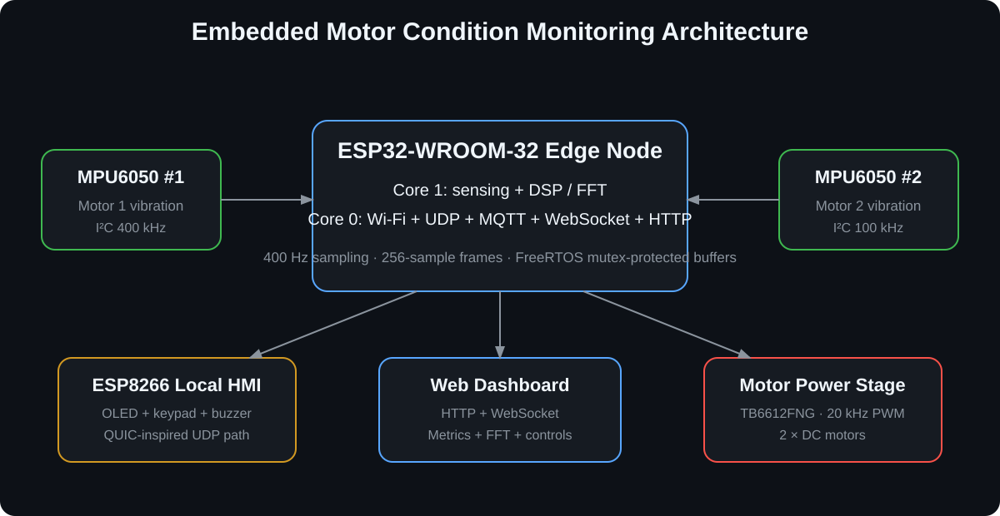

# System Architecture

## Overview

The project is a distributed embedded condition-monitoring platform with three main layers:

1. **ESP32 edge-processing node** — dual vibration acquisition, DSP, motor control and networking.
2. **ESP8266 local HMI** — operator feedback, local controls, alerts and discovery.
3. **Browser / central monitoring layer** — WebSocket dashboard plus secondary MQTT telemetry.

## ESP32 edge node

The ESP32-WROOM-32 is the primary compute node. The firmware deliberately separates time-critical sensing/DSP from network activity using FreeRTOS task pinning.

| Core | Task | Main responsibilities |
|---|---|---|
| Core 1 | `SensTask` | MPU6050 acquisition, 256-sample frame construction, FFT, condition metrics |
| Core 0 | `NetTask` | UDP, MQTT, WebSocket, HTTP and Wi-Fi services |

The sensor task runs at higher priority. Shared metrics and FFT arrays are protected with FreeRTOS mutexes before the network task reads them.

## Sampling and DSP

Verified configuration:

- sampling frequency: **400 Hz**;
- frame length: **256 samples**;
- Nyquist limit: **200 Hz**;
- manual Hamming windowing;
- low-frequency suppression below approximately 10 Hz after FFT processing.

The processing chain is:

1. acquire 3-axis acceleration from each MPU6050;
2. subtract calibrated sensor offsets;
3. calculate acceleration-vector magnitude;
4. remove the static gravity component;
5. remove the frame mean;
6. calculate RMS, peak and crest factor;
7. apply a Hamming window;
8. execute FFT and convert complex values to magnitude;
9. suppress low-frequency/DC-region bins;
10. extract dominant frequency and relative spectral-band energy;
11. calculate the RMS-derived health indicator.

## Extracted features

- RMS vibration;
- peak amplitude;
- crest factor;
- dominant frequency;
- relative energy in the configured **100–180 Hz** band;
- 0–100% RMS-derived health indicator.

The bearing-oriented 100–180 Hz feature is a project-specific engineering indicator. It is not a universal bearing-fault classifier and should be recalibrated for other motors, speeds and structures.

## Dual-Bus I2C acquisition

| Sensor path | SDA | SCL | Bus speed |
|---|---:|---:|---:|
| I2C Bus 0 | GPIO 21 | GPIO 22 | 400 kHz |
| I2C Bus 1 | GPIO 18 | GPIO 19 | 100 kHz |

Using both ESP32 hardware I2C controllers avoids an external multiplexer for the two vibration sensors.

The technical report also documents a non-standard MPU6050-compatible device returning `WHO_AM_I = 0x72`. The prototype library validation path was adapted to accept that device during testing.

## Motor control

Two DC motors are driven through a TB6612FNG dual H-bridge.

- PWM frequency: **20 kHz**;
- PWM resolution: **8 bit**;
- independent direction control;
- standby/emergency-stop capability;
- software soft-start behavior in network-driven commands.

The documented hardware uses a **100 nF** logic-side decoupling capacitor and **470 µF** bulk capacitance on the motor supply to reduce disturbances from inductive loads and startup current.

## Local HMI

The HMI uses an ESP8266 IdeaSpark-style board with integrated SSD1306 OLED. A PCF8574 I/O expander shares the display I2C bus and provides the I/O required by the 4×4 keypad. A buzzer provides warning feedback.

Software modules cover display rendering, input, networking, settings and application state. The report describes full-frame U8g2 rendering with a 1024-byte OLED buffer to avoid flicker while keeping network handling responsive.

## Communication architecture

### Custom UDP (“QUIC-lite”)

The local HMI path is a **custom UDP protocol inspired by QUIC’s low-latency design goals**. It performs local discovery and carries telemetry / motor commands without a TCP connection setup. It is not standards-compliant QUIC. The README uses the original sequence diagram from the submitted project documentation. See [`COMMUNICATIONS.md`](COMMUNICATIONS.md).

### MQTT

A secondary telemetry route toward a central monitoring station / CLI.

### WebSocket

Used for browser telemetry and FFT updates.

### HTTP

The ESP32 serves the SPA files from SPIFFS and applies client-side cache headers.

## Dashboard dependency note

The web application itself is stored in ESP32 SPIFFS, but the current `index.html` imports Chart.js from `cdn.jsdelivr.net`. Consequently, the present dashboard is **locally hosted but not completely offline/self-contained**. Bundling Chart.js into the SPIFFS data folder is recommended for fully offline operation.

## Edge-computing intent

The core design principle is to process raw vibration data near the monitored asset. High-rate samples are converted into diagnostic features locally; only compact telemetry and spectra are distributed to the HMI, browser and higher-level monitoring path. This demonstrates a practical edge-processing architecture while keeping the limitations of the prototype explicit.
